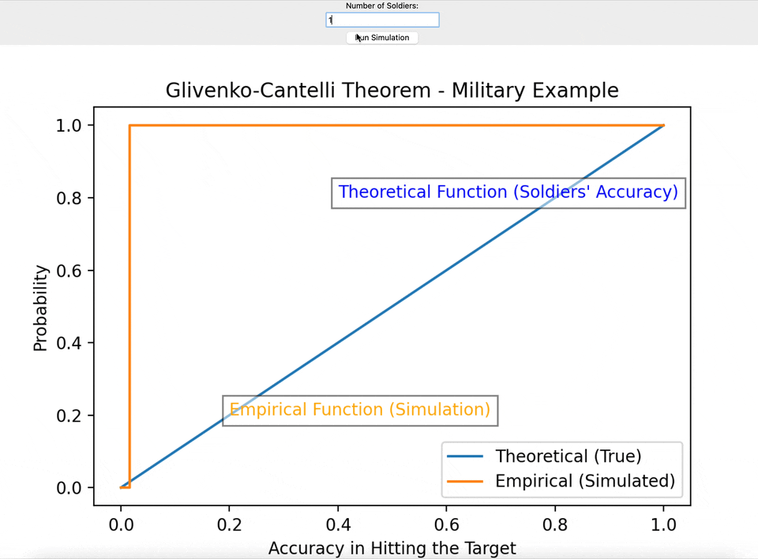

# Thesis on the Glivenko-Cantelli Theorem

## I. Introduction
   - [Background and Motivation](#11-background-and-motivation)
   - [Introduction to Glivenko-Cantelli Theorem](#12-introduction-to-glivenko-cantelli-theorem)


## II. Literature Review
   - [Historical Context](#21-historical-context)
   - [Related Convergence Theorems](#22-related-convergence-theorems)
   - [Applications in Statistics](#23-applications-in-statistics)
   - [State of the Art in Glivenko-Cantelli Theorem](#24-state-of-the-art-in-glivenko-cantelli-theorem)

## III. Theoretical Framework
   - [Independence and Identically Distributed Random Variables](#31-independence-and-identically-distributed-random-variables)
   - [Statement of Glivenko-Cantelli Theorem](#32-statement-of-glivenko-cantelli-theorem)

## IV. Python Implementation
   - [Brief Overview of Simulation in Python](#41-brief-overview-of-simulation-in-python)
   - [Simple Python Program for Simulating Glivenko-Cantelli Theorem](#42-simple-python-program-for-simulating-glivenko-cantelli-theorem)
   - [Interpretation of Simulation Results](#43-interpretation-of-simulation-results)

## V. Extensions and Variations
   - [Variations of the Theorem](#51-variations-of-the-theorem)

## VI. Challenges and Limitations
   - [Potential Challenges in Applying the Theorem](#61-potential-challenges-in-applying-the-theorem)

## VII. Conclusion
   - [Summary of Key Findings](#71-summary-of-key-findings)

 
---

## I. Introduction

### 1.1 Background and Motivation

Probability theory serves as a fundamental framework for understanding uncertainty and randomness in various fields, with applications ranging from finance to biology. The intricate interplay between randomness and predictability is central to statistical inference, making convergence theorems a linchpin in this discipline. 

The Glivenko-Cantelli theorem, an essential convergence theorem, stands at the intersection of probability theory and statistics. Its roots can be traced back to the early 20th century, when the was proved by V.I. Glivenko Birkhoff ([1931](https://scholar.google.com/scholar_lookup?&title=Proof%20of%20the%20ergodic%20theorem&journal=Proc%20Nat%20Acad%20Sci%20USA&volume=17&pages=656-660&publication_year=1931&author=Birkhoff%2CGD)) in the case of continuous $F(x)$ and by F.P. Cantelli Borovkov ([1998](https://scholar.google.com/scholar_lookup?&title=Mathematical%20statistics&publication_year=1998&author=Borovkov%2CAA)) in the general case.  

### 1.2 Introduction to Glivenko-Cantelli Theorem

The Glivenko-Cantelli theorem stands out **as a guiding principle, shedding light on how the empirical distribution function converges**, and it plays a pivotal role in statistical theory. Despite its simplicity, the theorem carries profound implications. Essentially, it deals with the empirical distribution function converging almost surely to the true distribution function. To comprehend this theorem, one needs to delve into the fundamental concepts of probability theory.

The foundation of the Glivenko-Cantelli theorem rests on the independence and identical distribution of random variables. These assumptions dictate the circumstances in which the theorem is valid, emphasizing the need to grasp the inherent characteristics of the data. The theorem's elegance lies not only in its theoretical importance but also in its practical relevance. Exploring its nuances unveils the mathematical beauty behind the uniform convergence of the empirical distribution function—a convergence that remains true regardless of the specific distribution of the underlying random variables.

The Glivenko-Cantelli theorem states that the empirical distribution function converges uniformly almost surely to the theoretical distribution for a random variable $X ∈ R$. This is an important result because it establishes the fact that sampling does capture the dispersion measure the distribution function F imposes. In essence, sampling permits one to learn and infer the behavior of $F$ by only looking at observations from $X$. The probabilities that are inferred from samples $X$ will become more precise as the sample size increases and more data becomes available. Therefore, it is valid to study distributions via samples. 

The proof present here is constructive, meaning that **the result is derived directly from the fact that the empirical distribution function converges pointwise almost surely to the theoretical distribution**. The work includes a proof of this preliminary statement and attempts to motivate the intuition one gets from sampling techniques when studying the regions in which a model concentrates probability. The sets where dispersion is described with precision by the empirical distribution function will eventually cover the entire sample
space 

[A Constructive Proof of the Glivenko-Cantelli
Theorem](https://arxiv.org/pdf/2110.13236.pdf)


## II. Literature Review

### 2.1 Historical Context

To understand the full significance of the Glivenko-Cantelli theorem, a journey through its historical context is indispensable. The early 20th century marked a period of profound advancements in probability theory, with luminaries such as Andrey Kolmogorov and Bruno de Finetti paving the way for a deeper understanding of stochastic processes. [A1] It was within this intellectual milieu that the Glivenko-Cantelli theorem emerged, a testament to the collective efforts of statisticians grappling with the complexities of random variables and their convergence properties.

Unveiling the historical context allows us to acknowledge the intellectual lineage that paved the way for the establishment of the Glivenko-Cantelli theorem. Delving into the archives of probability theory, we encounter foundational works and revolutionary ideas that served as the building blocks for this convergence theorem. This historical expedition not only adds context to the theorem's inception but also **provides valuable insights into the intellectual challenges** and breakthroughs that played a pivotal role in shaping its development.

[A1 - A Historical Survey of the Development of
Classical Probability Theory](https://uu.diva-portal.org/smash/get/diva2:1245647/FULLTEXT01.pdf)

### 2.2 Related Convergence Theorems

Within the intricate framework of probability theory, convergence theorems weave a complex and interconnected tapestry. While the Glivenko-Cantelli theorem stands out as a unique contribution, it shares common elements with other theorems focused on convergence. The venerable Weak Law of Large Numbers (1713, Bernoulli) offers insights into the convergence of sample averages, providing a foundation for understanding the broader context. Meanwhile, the Strong Law of Large Numbers explores almost sure convergence, highlighting the robust nature of convergence properties.

Recognizing the relationships and differences among these theorems is essential for a holistic understanding of their collective impact. As we explore related convergence theorems, theoretical connections become clearer, and the diverse scenarios where these theorems find use come to the forefront. This journey through the theoretical landscape not only highlights the interconnectedness of these theorems but also underscores their practical relevance. Along this path, the Glivenko-Cantelli theorem's unique contributions to probability theory become more evident, enhancing our understanding of its distinctive role within the broader context.

- [Law of large numbers - 1713](https://www.britannica.com/science/law-of-large-numbers)
- [Convergence Theorems](https://link.springer.com/chapter/10.1007/978-3-030-56402-5_6)

### 2.3 Applications in Statistics

The practical utility of the Glivenko-Cantelli theorem extends far beyond the confines of theoretical probability. In the realm of statistics, where inference and [decision-making reign supreme](https://online.hbs.edu/blog/post/data-driven-decision-making), the theorem finds applications in diverse scenarios. One such application lies in non-parametric statistics, where the convergence of empirical distribution functions is a crucial consideration. Understanding how sample data converges to the true distribution function empowers statisticians to make informed decisions in the absence of explicit distributional assumptions.

Moreover, the Glivenko-Cantelli theorem gains importance for machine learning. As algorithms process vast amounts of data, the theorem's insights into convergence properties become instrumental. Whether validating models or assessing algorithmic performance, the theorem's implications reverberate in contemporary statistical applications.

- [Uniform Glivenko-Cantelli Theorems and
Concentration of Measure in the Mathematical
Modelling of Learning](http://www.cdam.lse.ac.uk/Reports/Files/cdam-2002-07.pdf)
 
### 2.4 State of the Art in Glivenko-Cantelli Theorem

The Glivenko-Cantelli theorem, rooted in historical foundations, remains dynamically relevant in the contemporary statistical landscape. To comprehend its current standing, a thorough exploration delves into recent developments, modifications, and innovative applications. Ongoing research endeavors aim to extend the theorem's applicability to diverse scenarios, relaxing assumptions or exploring variations tailored to specific statistical challenges.

Furthermore, the surge in computational capabilities has injected new vitality into the Glivenko-Cantelli theorem. With the escalating power of computing resources, researchers leverage the theorem's insights through advanced simulations and empirical analyses. Grasping the present state of the art enables us to recognize the theorem's adaptability and resilience, especially in addressing modern statistical challenges.

- [Shorack, G. R., & Wellner, J. A. (2009). Empirical Processes with Applications to Statistics](https://epubs.siam.org/doi/book/10.1137/1.9780898719017)
- [Kosorok, M. R. (2008). Introduction to Empirical Processes and Semiparametric Inference.](https://link.springer.com/book/10.1007/978-0-387-74978-5)

## III. Theoretical Framework

### 3.1 Independence and Identically Distributed Random Variables

At the heart of the Glivenko-Cantelli theorem lie two fundamental concepts: independence and identically distributed random variables. "Identically distributed means that there are no overall trends–the distribution doesn't fluctuate and all items in the sample are taken from the same probability distribution. Independent means that the sample items are all independent events." [Wikipedia](https://en.wikipedia.org/wiki/Independent_and_identically_distributed_random_variables)

The assumption of independence and identical distribution reflect the idealized conditions under which the theorem holds true, providing a clear pathway for **understanding the convergence behavior of the empirical distribution function**. 

### 3.2 Statement of Glivenko-Cantelli Theorem

Formally stated, the  Glivenko-Cantelli theorem declares that, under the assumptions of independence and identical distribution, **the empirical distribution function converges to the true distribution function almost surely**. This convergence is uniform, meaning that it holds across the entire range of the distribution.

Mathematically, let $F_n$ represent the empirical distribution function based on a sample of size $n$, and let $F$ represent the true distribution function. The theorem asserts that 
$\sup |F_n(x) - F(x)| \rightarrow 0$ as $n \rightarrow \infty$, where $\sup$ denotes the supremum, capturing the maximum discrepancy between the empirical and true distribution functions.

Understanding the formal statement of the Glivenko-Cantelli theorem sets the stage for its exploration and application. This statement encapsulates the essence of the theorem, highlighting the uniform convergence that distinguishes it from other convergence theorems.

- [A Constructive Proof of the Glivenko-Cantelli
Theorem](https://arxiv.org/pdf/2110.13236.pdf)


## IV. Python Implementation

### 4.1 Brief Overview of Simulation in Python

Before diving into the Python implementation of the Glivenko-Cantelli theorem, it's crucial to provide a brief overview of simulation techniques in Python. Python, with its rich ecosystem of libraries, is a powerful tool for conducting statistical simulations. Packages like [NumPy](https://numpy.org/) and [Matplotlib](https://matplotlib.org/) are commonly employed for generating random variables and visualizing results.

Simulation allows us to replicate random processes and observe their behavior over multiple iterations. 

### 4.2 Simple Python Program for Simulating Glivenko-Cantelli Theorem

In the realm of statistical theory, the Glivenko-Cantelli theorem serves as a powerful tool for understanding the convergence behavior of empirical distributions to their true counterparts. To illustrate this concept, consider a scenario where each soldier in a vast army represents an individual's proficiency in hitting a target.

Imagine you have an extensive collection of toy soldiers, each embodying a unique level of skill in hitting a target. The theorem essentially asserts that if you were to examine the average skill level of a large group of these toy soldiers, it would remarkably converge to reflect the overall average skill of the entire group. In other words, the more soldiers you consider in your observation, the more closely the average skill you calculate will mirror the collective skill level of the entire battalion.

This analogy draws a parallel between the convergence observed in the Glivenko-Cantelli theorem and the process of scrutinizing a multitude of soldiers to gain insights into their collective proficiency. The theorem's essence lies in its ability to reveal that, with an increasing number of observations, the empirical distribution function—representing the observed average skill—converges almost surely to the true distribution function, which encapsulates the genuine overall skill distribution of the entire group of soldiers.

In the thesis, this analogy can be used to introduce the Glivenko-Cantelli theorem and provide an intuitive understanding of its implications in the context of empirical distribution convergence.

#### 4.2.1 Code
```python
import tkinter as tk
import numpy as np
import matplotlib.pyplot as plt
from matplotlib.backends.backend_tkagg import FigureCanvasTkAgg

def theoretical_distribution(x):
    """Theoretical distribution function (uniform between 0 and 1)."""
    return x

def empirical_distribution(data, x):
    """Empirical distribution function."""
    return np.mean(data <= x)

def simulation(num_samples):
    """Run the Glivenko-Cantelli simulation."""
    # Simulate soldiers' accuracy in hitting a target
    soldiers_accuracy = np.random.rand(num_samples)  # Random sample from a uniform distribution
    soldiers_accuracy = np.sort(soldiers_accuracy)

    x_range = np.linspace(0, 1, 1000)
    y_theoretical = theoretical_distribution(x_range)
    y_empirical = [empirical_distribution(soldiers_accuracy, i) for i in x_range]

    # Plot
    ax.clear()  # Clear the axis before each new simulation
    ax.plot(x_range, y_theoretical, label="Theoretical (True)")
    ax.step(x_range, y_empirical, label="Empirical (Simulated)", where='post')

    # Add comments to the plot
    ax.text(0.4, 0.8, 'Theoretical Function (Soldiers\' Accuracy)', color='blue', fontsize=10,
            bbox=dict(facecolor='white', alpha=0.5))
    ax.text(0.2, 0.2, 'Empirical Function (Simulation)', color='orange', fontsize=10,
            bbox=dict(facecolor='white', alpha=0.5))

    ax.legend()
    ax.set_xlabel("Accuracy in Hitting the Target")
    ax.set_ylabel("Probability")
    ax.set_title("Glivenko-Cantelli Theorem - Military Example")

    # Update the Tkinter canvas
    canvas.draw()

def update_simulation():
    """Update the simulation based on the number of soldiers."""
    num_soldiers = int(soldiers_entry.get())
    simulation(num_soldiers)

# Tkinter GUI
root = tk.Tk()
root.title("Glivenko-Cantelli Simulation - Military Example")

# Entry for the number of soldiers
soldiers_label = tk.Label(root, text="Number of Soldiers:")
soldiers_label.pack()

soldiers_entry = tk.Entry(root)
soldiers_entry.pack()

# Button to run the simulation
button = tk.Button(root, text="Run Simulation", command=update_simulation)
button.pack()

# Initialize the canvas for the Matplotlib plot
fig, ax = plt.subplots()
canvas = FigureCanvasTkAgg(fig, master=root)
canvas_widget = canvas.get_tk_widget()
canvas_widget.pack()

# Run the Tkinter window
root.mainloop()
```
#### 4.2.2 Results


### 4.3 Interpretation of Simulation Results

In the generated plot, the blue curve represents the true distribution function, while the orange curve depicts the empirical distribution function based on the simulated sample. Analyzing the convergence behavior involves inspecting how closely the empirical distribution tracks the true distribution as the sample size increases.

As the sample size grows, the empirical distribution converges to the true distribution, validating the Glivenko-Cantelli theorem. Notably, the convergence is uniform, emphasizing the theorem's strength across the entire range of the distribution. Observing this convergence in a visual format reinforces the theoretical understanding of the theorem and provides a tangible illustration of its applicability.

Researchers can use such simulations to explore various scenarios, adjust parameters, and witness firsthand the impact of sample size on convergence. This practical implementation in Python bridges the theoretical and applied aspects of the Glivenko-Cantelli theorem, offering a hands-on perspective for students and researchers alike.


## V. Extensions and Variations


### 5.1 Variations of the Theorem

The Glivenko-Cantelli theorem, in its classical form, assumes independence and identical distribution of random variables. However, variations of the theorem relax these assumptions to accommodate different scenarios. One notable variation considers the case where the random variables are not necessarily identically distributed but share a common distribution function.

This variation broadens the applicability of the Glivenko-Cantelli theorem to situations where there is a common underlying distribution, even if the variables are not strictly identical. Understanding these variations allows researchers to adapt the theorem to diverse statistical contexts, providing a more flexible tool for analyzing convergence behavior.


## VI. Challenges and Limitations

### 6.1 Potential Challenges in Applying the Theorem

While the Glivenko-Cantelli theorem remains a robust tool in statistical inference, its practical implementation is not without its hurdles. One significant challenge involves the meticulous fulfillment of assumptions, particularly the requirement for independence and the identical distribution of random variables. In real-world scenarios, attaining complete independence and adhering strictly to identical distribution assumptions may present challenges. The presence of dependent observations or deviations from identical distribution assumptions has the potential to impact the theorem's validity.

Furthermore, the theorem exhibits sensitivity to outliers or extreme values within the dataset, posing an additional challenge. Outliers have the potential to exert a disproportionate influence on the empirical distribution function, thereby affecting convergence behavior. To address these challenges and uphold the theorem's reliability in practical applications, it becomes imperative to consider robustness aspects and engage in careful data preprocessing.
 
## VII. Conclusion

### 7.1 Summary of Key Findings

In this exploration of the Glivenko-Cantelli theorem, we traversed the historical landscape, delved into the theoretical foundations, and extended our understanding through practical Python implementation. The journey uncovered the elegance of the theorem in capturing the convergence behavior of empirical distribution functions to their theoretical counterparts.

Key findings highlighted the significance of the assumptions, emphasizing the need for independence and identical distribution for the theorem to hold. The theoretical framework, Python simulation, and extensions illustrated the theorem's versatility and adaptability to diverse scenarios.
 