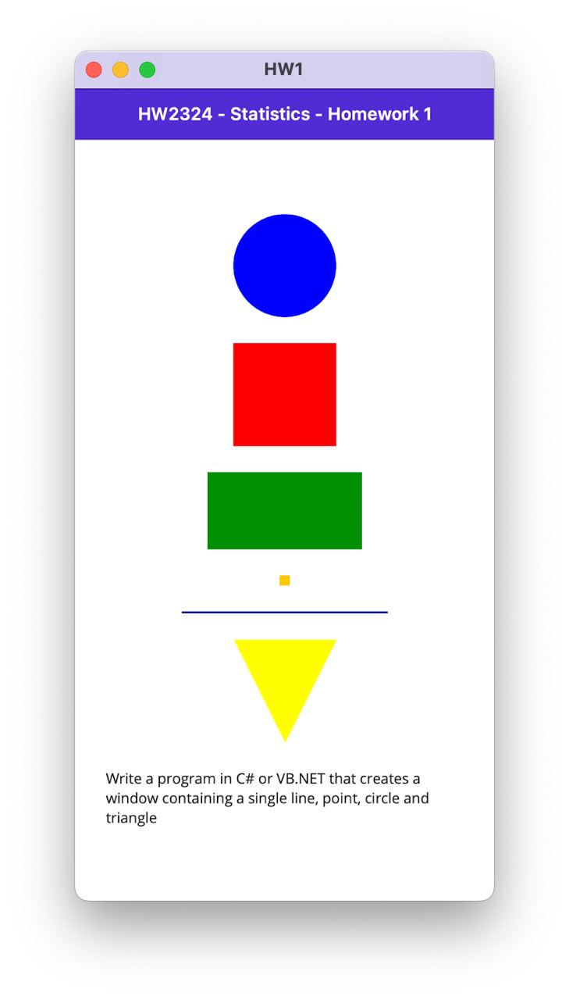

# Theory
## 1. What is Statistics and its relationship with other disciplines. Difference between Descriptive and Inferential Statistics.
**Statistics** is a branch of mathematics and a field of study that involves the collection, analysis, interpretation, presentation, and organization of data. It is used to gain insights, draw conclusions, and make decisions based on data. Statistics plays a crucial role in various disciplines and is increasingly relevant in the context of cybersecurity.

**Relationship with Cybersecurity**:
Statistics is becoming increasingly important in the field of cybersecurity for several reasons:

1. **Anomaly Detection**: Statistics is used for detecting anomalies in network traffic and system behavior. By analyzing patterns and deviations from the norm, statisticians and data scientists can identify potential security threats. [ref](https://citeseerx.ist.psu.edu/document?repid=rep1&type=pdf&doi=c49f48f734e6fdf9b5eaed908c961448f581d57c)

2. **Intrusion Detection**: Statistical models are employed in intrusion detection systems to detect and respond to unauthorized access or cyberattacks. These systems use statistical techniques to identify unusual behavior.

3. **Incident Response**: After a security incident, statistics can help in analyzing data logs and other sources of information to understand the extent of the breach and the methods used by attackers. [ref](https://securityscorecard.com/blog/how-to-use-incident-response-metrics/)

4. **Risk Assessment**: Statistics is used to assess the risks associated with various cybersecurity threats and vulnerabilities. This helps organizations prioritize security measures and allocate resources effectively. [ref](https://iopscience.iop.org/article/10.1088/1757-899X/396/1/012029/pdf)

5. **Forensics**: In cyber forensics, statistical methods can be used to trace and analyze digital evidence in cases of cybercrimes. [ref](https://farid.berkeley.edu/downloads/publications/ih04.pdf)

**Descriptive vs. Inferential Statistics**:

**Descriptive Statistics**:
* **Purpose**: Descriptive statistics are used to summarize and describe the main features of a dataset. They provide a clear and concise summary of the data, allowing researchers to understand the data's basic characteristics.
* **Methods**: Descriptive statistics include measures such as mean, median, mode, standard deviation, and graphical representations like histograms, bar charts, and scatter plots.
* **Example**: Calculating the average age of a group of people or creating a histogram of website traffic data.

**Inferential Statistics**:
* **Purpose**: Inferential statistics are used to make inferences or predictions about a population based on a sample of data. They help researchers draw conclusions and make generalizations from limited data.
* **Methods**: Inferential statistics include hypothesis testing, regression analysis, and confidence intervals. These methods allow researchers to make predictions, test hypotheses, and assess the reliability of their findings.
* **Example**: Conducting a hypothesis test to determine if a new cybersecurity software is effective in reducing the number of security breaches.

In summary, statistics plays a vital role in the field of cybersecurity, helping organizations detect threats, assess risks, and respond to security incidents. Descriptive statistics provide an overview of data, while inferential statistics enable researchers to make predictions and draw conclusions from data, which is especially valuable in the context of cybersecurity.

## 2. Describe the concepts of Population, Sample Attribute, Variable, Level of measurement and Dataset.

* *Attribute*: a general abstract concept or idea from which we can obtain multiple variables
* *Variable*: essentially it’s what we want to know, it’s what we observe from a statistical unit, usually we want variables that are relevant to the phenomena that we want to investigate. The relationship between variable and attribute is that a variable is how we can measure an attribute
* *Population*: also known as statistical population, it’s the entire group that we want to draw conclusions about
* *Sample*: specific group of individuals that we will collect data from, which is a subset of a population
* *Dataset*: a table or matrix where each column we have a variable and each row is a statistical unit, usually easily manipulated by a computer

## 3. Briefly describe the main sampling methods

Simple random sampling, cluster sampling, and accidental sampling are three different methods used in the field of statistics and research to select a subset of individuals or elements from a larger population. Each method has its own characteristics and is suitable for different types of research situations. 

### Simple Random Sampling

* Definition: Simple random sampling is a method in which every individual or element in the population has an equal chance of being selected for the sample.
* Process: To perform simple random sampling, you would assign a unique identifier or number to each member of the population. Then, you use a random method, like a random number generator or drawing lots, to select a specified number of individuals from the population without any bias.
* Advantages:
    It ensures that every element in the population has an equal probability of being included in the sample.
    It is straightforward and relatively easy to implement.
* Disadvantages:
    It can be time-consuming and impractical for very large populations.
    It may not capture specific subgroups of interest if not properly stratified.

### Cluster Sampling
* Definition: Cluster sampling is a method in which the population is divided into clusters or groups, and then a random sample of clusters is selected for the study. All individuals within the selected clusters are included in the sample.
* Process: Instead of selecting individuals directly, you randomly select a subset of clusters from the population, and then you collect data from all members within those selected clusters.
* Advantages:
    It can be more cost-effective and convenient, especially when the population is geographically dispersed.
    It can be practical when it is difficult to create a comprehensive list of the entire population.
* Disadvantages:
    It may introduce some degree of sampling bias if the clusters are not homogeneous.
    It may not be suitable for situations where the variation within clusters is high.

### Convenience Sampling
* Definition: Convenience sampling, also known as accidental sampling, is a non-probability sampling method where individuals or elements for a sample are chosen based on their ease of accessibility and availability. It is a quick and straightforward approach that prioritizes convenience over representativeness.
* Process: In convenience sampling, researchers select participants who are most easily accessible, typically those who are nearby, known to the researcher, or willing to participate. This method is not based on random or systematic principles and relies on the convenience of selection.
* Advantages:
        Convenience sampling is quick, cost-effective, and requires minimal resources.
        It can be useful for exploratory or preliminary research when time and budget constraints are a concern.
* Disadvantages:
        One of the primary drawbacks is the potential for bias. Convenience sampling often leads to non-representative samples, as it may overrepresent certain groups and underrepresent others.
        Findings from convenience samples are generally not suitable for making broad generalizations about the entire population.
        It is prone to self-selection bias when individuals choose to participate, potentially leading to skewed results.
Each of these sampling methods has its own strengths and weaknesses, and the choice of method depends on the research objectives, available resources, and the level of accuracy required in the study. Simple random sampling is the most preferred method when unbiased, representative samples are needed, but it may not always be practical in real-world situations.

Sources [1](https://www.cloudresearch.com/resources/guides/sampling/what-is-the-purpose-of-sampling-in-research/) [2](https://www.investopedia.com/ask/answers/042815/what-are-disadvantages-using-simple-random-sample-approximate-larger-population.asp) [3](https://www.scribbr.com/methodology/convenience-sampling/)

## 4. Briefly describe the main experiment designs 
There are several main experimental designs used in scientific research. Here's a brief description of some of the key experimental designs:
* Pre-Post Test Design:
        In this design, researchers measure a group of participants both before and after they are exposed to an experimental treatment or intervention. The goal is to assess the impact of the treatment by comparing the pre-test and post-test results.
* Randomized Controlled Trial (RCT):
        RCT is a gold standard in experimental research. Participants are randomly assigned to either a treatment group or a control group. The treatment group receives the experimental intervention, while the control group does not. This design helps assess the cause-and-effect relationship between the treatment and outcomes.
* Between-Subjects Design:
        In this design, participants are divided into different groups, and each group is exposed to a different experimental condition or treatment. The outcomes are then compared across groups to determine the effect of the different conditions.
* Within-Subjects Design:
        Also known as a repeated measures design, all participants are exposed to all experimental conditions. This design is useful for studying changes within the same group of participants over time or under different conditions.
* Crossover Design:
        Commonly used in clinical trials, this design involves switching participants between different treatments or conditions in a sequential manner. It helps control for individual differences and assess the long-term effects of treatments.
* Single-Subject Design:
        This design is often used in behavioral and clinical research. It involves the repeated measurement of a single participant's behavior over time to evaluate the effects of an intervention.
* Naturalistic Observation:
        In this non-experimental design, researchers observe and record the behavior of participants in their natural environment without any manipulation of variables. It is useful for studying behavior as it occurs naturally.
* Longitudinal Study:
        Longitudinal studies involve the collection of data from the same participants over an extended period of time, often years or decades. They are used to examine changes and developments over time.
* Cross-Sectional Study:
        Cross-sectional studies collect data from participants at a single point in time, allowing researchers to examine differences among different age groups or populations.

These are some of the main experimental designs used in scientific research, each with its specific advantages and applications. The choice of design depends on the research questions, objectives, and practical considerations of the study.

Sources [1](https://scholar.google.it/scholar_url?url=https%3A%2F%2Fedisciplinas.usp.br%2Fpluginfile.php%2F5283848%2Fmod_resource%2Fcontent%2F0%2FKESMOD%7E1.PDF&hl=it&scisig=AFWwaeYVYqxC_UCTYSQzsG1xh97d&oi=scholarr) [2](https://www.ahajournals.org/doi/full/10.1161/CIRCULATIONAHA.105.594945) [3](https://study.com/learn/lesson/pretest-posttest-design-concept-examples.html)
 

# Practice
For sourcecode of this homework please check [HERE](https://github.com/Owanesh/HWSTAT2324/tree/main/source)

**Assignation**
Write a program in C# or VB.NET that creates a window containing a single line, point, circle, rectangle

### JavaScript

```javascript
var canvas = document.getElementById("myCanvas");
var context = canvas.getContext("2d");
context.clearRect(0, 0, canvas.width, canvas.height);
// Green Rectangle
       context.beginPath();
       context.rect(20, 20, 100, 60);
       context.strokeStyle = "green";
       context.lineWidth = 4;
       context.stroke();

// Blue Circle
       context.beginPath();
       context.arc(160, 50, 30, 0, 2 * Math.PI);
       context.strokeStyle = "blue";
       context.lineWidth = 4;
       context.stroke();
```
<button onclick="generateShapers()">Try Me</button>
<canvas id="myCanvas" width="800" height="100"></canvas>

<script>
    function generateShapers(){
    // Obtaining Canvas Reference
    var canvas = document.getElementById("myCanvas");
    var context = canvas.getContext("2d");
        context.clearRect(0, 0, canvas.width, canvas.height);
    // Green Rectangle
    context.beginPath();
    context.rect(20, 20, 100, 60);
    context.strokeStyle = "green";
    context.lineWidth = 4;
    context.stroke();

    // Blue Circle
    context.beginPath();
    context.arc(160, 50, 30, 0, 2 * Math.PI);
    context.strokeStyle = "blue";
    context.lineWidth = 4;
    context.stroke();

    // Red Square
    context.beginPath();
    context.rect(220, 20, 80, 80);
    context.strokeStyle = "red";
    context.lineWidth = 4;
    context.stroke();

    // Yellow Line
    context.beginPath();
    context.moveTo(320, 20);
    context.lineTo(320, 80);
    context.strokeStyle = "yellow";
    context.lineWidth = 4;
    context.stroke();

    // Pink Triangle
    context.beginPath();
    context.moveTo(380, 20);
    context.lineTo(440, 20);
    context.lineTo(410, 60);
    context.closePath();
    context.strokeStyle = "pink";
    context.lineWidth = 4;
    context.stroke();
    }
</script>

### CSharp

```xml
# MainPage.xaml
<?xml version="1.0" encoding="utf-8" ?>
<ContentPage xmlns="http://schemas.microsoft.com/dotnet/2021/maui"
             xmlns:x="http://schemas.microsoft.com/winfx/2009/xaml"
             x:Class="HW1.MainPage">

    <ScrollView>
        <VerticalStackLayout
            Spacing="25"
            Padding="30,0"
            VerticalOptions="Center">

            <!-- Blue Circle -->
            <BoxView Color="Blue" WidthRequest="100" HeightRequest="100" CornerRadius="50" HorizontalOptions="Center" VerticalOptions="Center"/>

            <!-- Red Square -->
            <BoxView Color="#FF0000" WidthRequest="100" HeightRequest="100" HorizontalOptions="Center" VerticalOptions="Center"/>

            <!-- Green Rectangle -->
            <BoxView Color="#009000" WidthRequest="150" HeightRequest="75" HorizontalOptions="Center" VerticalOptions="Center"/>

            <!-- Yellow Dot -->
            <BoxView Color="#FFC900" WidthRequest="10" HeightRequest="10" HorizontalOptions="Center" VerticalOptions="Center"/>

            <!-- Dark Blue Line -->
            <BoxView Color="#07079D" WidthRequest="200" HeightRequest="2" HorizontalOptions="Center" VerticalOptions="Center"/>

            <!-- Yellow Triangle -->
            <Path x:Name="trianglePath" Data="M0,0 L50,100 L100,0 Z" Fill="Yellow" WidthRequest="100" HeightRequest="100" HorizontalOptions="Center" VerticalOptions="Center" />

            <Label Text="Write a program in C# or VB.NET that creates a window containing a single line, point, circle and triangle" />
        </VerticalStackLayout>
    </ScrollView>

</ContentPage>
```
