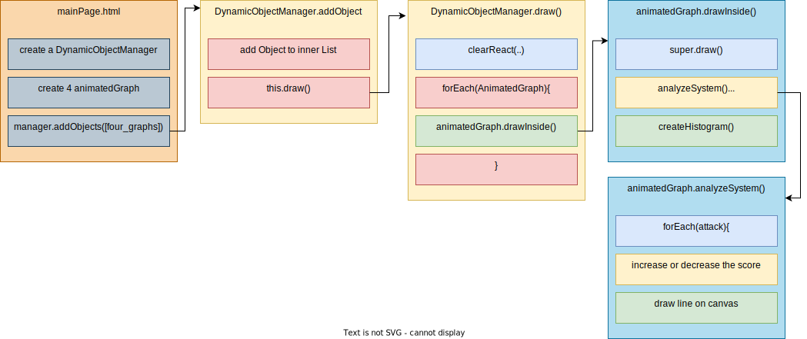
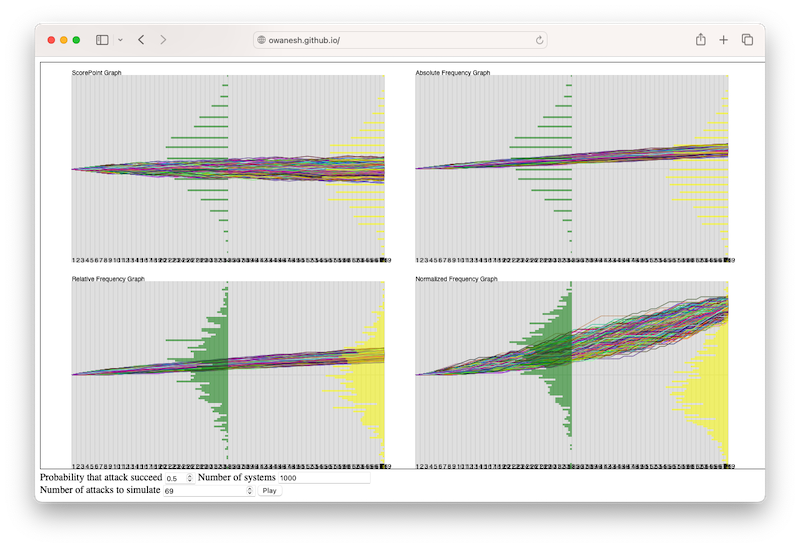

## Exercise 1
Have you ever wondered how the Law of Large Numbers works in real-life scenarios? In this project, we'll dive into the world of statistics and probability to demonstrate the fascinating concept that, with a significant number of trials, the distribution of values tends to converge to a normal distribution. To illustrate this, we'll create four graphs with their corresponding histograms, exploring different aspects of the Law of Large Numbers.

>#### Assignation
>
>**Part a**
>
>$M$ systems are subject to a series of $N$ attacks. On the x-axis, we indicate the attacks and on the Y-axis we
simulate the accumulation of a "security score" (-1, 1), where the score is -1 if the system is penetrated
and 1 if the system was successfully "shielded" or protected. Simulate the score "trajectories" for all systems,
assuming, for simplicity, a constant penetration probability $p$ at each attack.
>
>**Part b**
>
>Same as before, but simulate the cumulated frequency, say $f$, of penetration. Do the same with the relative
frequency $\frac{f}{number}$ of attacks and the "normalized" ratio: $\frac{f}{\sqrt{number}}$ of attacks.
>
>
>**Discussion point:**
Is what you see what you expected? What about the averages of the distributions and the shapes of the histograms:
do you see regularities, differences and can you attempt to explain what you see or guessing what are
the "theoretical" limit distribution, when as $N$ increases, and you can make the distribution simulation "more detailed" by increasing $M$ ?


 


### Javascript
Below a brief description of application flow

```js
/** mainpage.html */
    const app = new DynamicObjManager("myCanvas");
    const initialRectSize = { width: 500, height: 300 };
    const probInput = parseFloat(document.getElementById("probInput").value);
        const sysInput = parseInt(document.getElementById("sysInput").value);
        const nAttacks = parseInt(document.getElementById("nAttacks").value);

        const graphSettings = { probability: probInput, nSystems: sysInput, nAttacks: nAttacks };
        
    const graphUISettings = { label:"ScorePoint Graph",fill: "rgba(200, 200, 200, 0.5)", border: "black", borderWidth: 2 }

    const attackManager = new AttackMonitor(graphSettings)
    const attackMatrix = attackManager.getMatrix()

    var graph1 = new AnimatedGraph(app.canvas, {...initialRectSize,x: 50, y: 20},{...graphUISettings,label:"ScorePoint Graph"}, {...graphSettings,mode: "SCR" })
    graph1.setAttackMatrix(attackMatrix)
    var graph2 = new AnimatedGraph(app.canvas, {...initialRectSize,x: 600, y: 20}, {...graphUISettings,label:"Absolute Frequency Graph"}, {...graphSettings,mode: "ABS" })
    graph2.setAttackMatrix(attackMatrix)
    var graph3 = new AnimatedGraph(app.canvas, {...initialRectSize,x: 50, y: 350}, {...graphUISettings,label:"Relative Frequency Graph"}, {...graphSettings,mode: "REL" })
    graph3.setAttackMatrix(attackMatrix)
    var graph4 = new AnimatedGraph(app.canvas, {...initialRectSize,x: 600, y: 350}, {...graphUISettings,label:"Normalized Frequency Graph"}, {...graphSettings,mode: "NOR" })
    graph4.setAttackMatrix(attackMatrix)
    app.addObjects([graph1, graph2,graph3,graph4]);
```

```js
/** animated.js */
analyzeSystem(attackVector) {
    var x = 0;
    var score = 1;
    this.context.strokeStyle = attackVector[0]['color']
    var numberOfAttacks = attackVector.length - 1
    var baseYaxis = this.rect.y + this.rect.height / 2
    let baseXaxis = this.rect.x
    let atkC = 0
    for (let i = attackVector.length; i > 0; i--) {
        atkC++
        this.context.beginPath();
        if (this.mode === "NOR")
        this.context.lineTo(baseXaxis + x, baseYaxis + (this.rect.height/(this.nSys/10) / numberOfAttacks) * (-score));
        else
            this.context.moveTo(baseXaxis + x, baseYaxis + (this.rect.height/2  / numberOfAttacks) * -score);
        if (!attackVector[i]) {
            if (this.mode === "SCR") score--
        } else {
            if (this.mode === "REL") score += (this.realAttackCounter(attackVector,atkC)) / atkC;
            else if (this.mode === "NOR") { score += this.realAttackCounter(attackVector,atkC) / Math.sqrt(atkC) }
            else score++
        }
        x = (attackVector.length - i) * (this.rect.width / (numberOfAttacks));
        if (this.mode === "NOR")
        this.context.lineTo(baseXaxis + x, baseYaxis + (this.rect.height/(this.nSys/10) / numberOfAttacks) * (-score));
        else
            this.context.lineTo(baseXaxis + x, baseYaxis + (this.rect.height/2 / numberOfAttacks) * (-score));
        this.context.stroke();
        if (Math.floor(numberOfAttacks / 2) == i) { attackVector[0]['middle'] = (score) }
    }
    attackVector[0]['final'] = (score)
}
```
The creation of attack matrix is in charge of [attackMonitor.js](https://github.com/Owanesh/HWSTAT2324/blob/main/source/JavaScript/HW3/attackMonitor.js)
```js
// attackMonitor.js
buildMatrix() {
    const matrix = [];
    for (let i = 0; i < this.nSys; i++) {
        const row = [];
        row.push({color:"#" + ((1 << 24) * Math.random() | 0).toString(16),final:0,middle:0})
        for (let j = 0; j < this.nAtk; j++) {
            // Populates the matrix with true or false based on the attack probability
            row.push(Math.random() <= this.probability ? true : false);
        }
        matrix.push(row);
    }
    return matrix;
}
```
With this matrix we have a unique color for each system, that is shared among charts. And each graph with relative logic populate field "final", that represents the final score of selected system.

[Try It 🕹️](../assets/labs/hw3/exercise.html)



For this homework, also class Rectangle have to be built, with all interfaces for drag and resize action. Full implementation is available 
[Here](https://github.com/Owanesh/HWSTAT2324/blob/main/source/JavaScript/HW3/utils/shapes.js)
### CSharp
The code in C# is a merely a transcription of what i've done in Javascript. Below there are the main parts of algorithm.

#### Attack simulation and score calculation

```csharp
 /**
 * Simula un attacco e aggiorna il grafico.
 *
 * @param penetrated Specifica se l'attacco è riuscito a penetrare il sistema.
 * @param color Il colore da utilizzare per rappresentare l'attacco.
 * @param _SYSTEMS_COUNT Il numero di sistemi nel grafico.
 */
public void SimulateAttack(bool penetrated, Color color, int _SYSTEMS_COUNT)
{
    // Utilizza il using per garantire la corretta gestione delle risorse grafiche.
    using (Graphics g = Graphics.FromImage(pictureBox.Image))
    {
        Brush brush = new SolidBrush(color);
        Pen pen = new Pen(color, 2);

        // Crea un rettangolo per il punto del grafico.
        Rectangle chartDot = new Rectangle((int)x - 1, (int)y - 1, 2, 2);

        // Riempie e disegna il punto del grafico.
        g.FillRectangle(brush, chartDot);
        g.DrawRectangle(pen, chartDot);

        // Calcola la nuova posizione X.
        x = rect.X + ++attacks * (rect.Width / (float)_COLUMNS);

        // Aggiorna la posizione Y in base al tipo di grafico e all'esito dell'attacco.
        UpdateYPosition(penetrated);

        // Disegna una linea tra i punti del grafico.
        DrawChartLine(g, pen);

        // Aggiorna il punto precedente.
        chartDot = new Rectangle((int)x - 1, (int)y - 1, 2, 2);
        g.FillRectangle(brush, chartDot);
        g.DrawRectangle(pen, chartDot);

        previousx = x;
        previousy = y;

        // Se sono stati effettuati abbastanza attacchi, completa una colonna del grafico.
        if (attacks == _COLUMNS)
        {
            ResetAfterColumnCompleted(_SYSTEMS_COUNT);
        }
    }
    pictureBox.Invalidate();
}

/**
 * Aggiorna la posizione Y del punto del grafico in base al tipo di grafico e all'esito dell'attacco.
 *
 * @param penetrated Specifica se l'attacco è riuscito a penetrare il sistema.
 */
private void UpdateYPosition(bool penetrated)
{
    if (!penetrated)
    {
        switch (ct)
        {
            case chartType.PlusMinus: y -= yStep / 2; score++; break;
            case chartType.Freq: y -= yStep; score++; break;
            case chartType.RelativeFreq: y -= (yStep * 4 / attacks); score = (++score / (int)attacks); break;
            case chartType.NormalizedFreq: y -= (yStep * 4 / (float)Math.Sqrt(attacks)); score = (++score / (int)Math.Sqrt(attacks)); break;
        }
    }
    else
    {
        switch (ct)
        {
            case chartType.PlusMinus: y += yStep / 2; score--; break;
        }
    }
}

/**
 * Disegna una linea tra i punti del grafico.
 *
 * @param g L'oggetto Graphics su cui disegnare la linea.
 * @param pen Il pennello da utilizzare per disegnare la linea.
 */
private void DrawChartLine(Graphics g, Pen pen)
{
    if (attacks == 1) g.DrawLine(pen, previousx, (ct == chartType.PlusMinus) ? HalfwayYPoint : rect.Bottom, x, y);
    else g.DrawLine(pen, previousx, previousy, x, y);
}

/**
 * Resetta le variabili e crea un istogramma dopo il completamento di una colonna del grafico.
 *
 * @param _SYSTEMS_COUNT Il numero di sistemi nel grafico.
 */
private void ResetAfterColumnCompleted(int _SYSTEMS_COUNT)
{
    this.x = rect.X;
    this.y = (ct == chartType.PlusMinus) ? HalfwayYPoint : rect.Bottom;

    this.results.Add(new Result(score, color));

    CreateHistogram(_SYSTEMS_COUNT);

    this.attacks = 0;
    this.score = 0;

    previousx = x;
    previousy = y;
}
```
#### Draw Histogram
```csharp
/**
 * Crea un istogramma basato sui risultati e lo disegna sul grafico.
 *
 * @param _SYSTEMS_COUNT Il numero di sistemi nel grafico.
 */
public void CreateHistogram(int _SYSTEMS_COUNT)
{
    if (results.Count <= _SYSTEMS_COUNT) return;

    float minScore = results.Min(result => result.result);
    float maxScore = results.Max(result => result.result);

    int boxes = Math.Max(5, results.Count / 10);

    float histogramRectWidth = rect.Width / boxes;

    int[] intervals = CalculateHistogramIntervals(minScore, maxScore, boxes);

    DrawHistogram(intervals, histogramRectWidth);
}

/**
 * Calcola gli intervalli dell'istogramma in base al punteggio minimo e massimo e al numero di caselle.
 *
 * @param minScore Il punteggio minimo nei risultati.
 * @param maxScore Il punteggio massimo nei risultati.
 * @param boxes Il numero di caselle dell'istogramma.
 *
 * @return Un array di interi che rappresenta il conteggio di elementi in ciascun intervallo.
 */
private int[] CalculateHistogramIntervals(float minScore, float maxScore, int boxes)
{
    float intervalWidth = (maxScore - minScore) / boxes;
    int[] intervals = new int[boxes];

    for (int i = 0; i < results.Count; i++)
    {
        double intervalIndex = Math.Floor((results[i].result - minScore) / intervalWidth);

        if (intervalIndex >= intervals.Length)
        {
            intervals[intervals.Length - 1]++;
        }
        else
        {
            intervals[(int)intervalIndex]++;
        }
    }

    return intervals;
}

/**
 * Disegna l'istogramma basato sugli intervalli calcolati.
 *
 * @param intervals Un array di interi che rappresenta il conteggio di elementi in ciascun intervallo.
 * @param histogramRectWidth Larghezza di ciascuna casella dell'istogramma.
 */
private void DrawHistogram(int[] intervals, float histogramRectWidth)
{
    for (int i = 0; i < intervals.Length; i++)
    {
        int histogramRectY = rect.Height / Math.Abs(intervals.Max());
        float histogramRectX = rect.X + i * histogramRectWidth;

        Rectangle histogramRect = new Rectangle(
            (int)histogramRectX,
            rect.Bottom - intervals[i] * histogramRectY,
            (int)histogramRectWidth,
            intervals[i] * histogramRectY
        );

        using (Graphics g = Graphics.FromImage(pictureBox.Image))
        {
            Color semiTransparentColor = Color.FromArgb(128, Color.Red);
            Brush semiTransparentBrush = new SolidBrush(semiTransparentColor);

            g.FillRectangle(semiTransparentBrush, histogramRect);

            semiTransparentBrush.Dispose();
        }
    }
}
```
### Conclusion

This experiment vividly illustrates the power of the Law of Large Numbers. As we increase the number of trials, the erratic and unpredictable nature of small samples gradually transforms into a more stable and predictable distribution. Whether we're examining scores or the frequencies of success and failure, the result is always a convergence towards a normal distribution.

This fundamental concept underpins many aspects of statistics, data analysis, and decision-making. Understanding the Law of Large Numbers allows us to make more accurate predictions and informed decisions based on data.

## Exercise 2
> **Assignation**
>_Recall briefly the definition and math notions relevant to "probability space" and make some simple examples, indicating among the triple of the space the meaning of each element in your particular example.
If you wanted to model probabilistically the homework Exercise 1, explain what are the 3 sets of your probability space and their elements, in this case._


The theory behind a probability space is a fundamental concept in probability theory and statistics. It provides a structured framework for understanding and quantifying uncertainty and random events.

### Sample Space (Ω)
The sample space represents the set of all possible outcomes of a random experiment. For example this could represents all the possible **outcomes when flipping the coin**. In our case, there are two possible results: "heads" (H) or "tails" (T).
### Events
Events are subsets of the sample space. They represent specific outcomes or combinations of outcomes that you are interested in. For example **events represent what you do at the gym**. We can have the event "Do push-ups" when "heads" (H) comes up and the event "Do squats" when "tails" (T) comes up.
### Probability
The probability measure assigns a probability to each event within the sigma-algebra (a collection of events). This measure satisfies certain rules or axioms

- **Non-negativity:** The probability of an event is never negative $(P(A) \ge 0 \forall event  A$).
- **Normalization:** The probability of the entire sample space is $1 (P(\Omega) = 1)$. This means that something has to happen, and the probability of everything in the sample space adds up to $1$.
- **Countable Additivity:** If you have a collection of mutually exclusive events (events that cannot happen at the same time), you can add their probabilities.

Continuing example, probability tells us how likely it is to get "heads" ($H$) or "tails" ($T$) when flipping the coin. In this case, let's assume the coin is fair, meaning it's equally likely to land on "heads" or "tails." So, the probability of $H$ is $\frac{1}{2}$, and the probability of $T$ is $\frac{1}{2}$

In this trivial example:

**Sample Space ($\Omega$)**: It's the list of possible coin toss outcomes, which are "heads" ($H$) and "tails" ($T$).

**Events**: Events represent what you do at the gym based on the coin toss result. For example, if "heads" comes up, you do push-ups, and if "tails" comes up, you do squats.

**Probability**: Probability tells us that there's a 50% chance of getting "heads" ($H$) and a 50% chance of getting "tails" ($T$) when flipping the coin because the coin is fair.

#### Let's make a proabilistic model of our exercise 1 


**Sample Space ($\Omega$):** The sample space stands for all the potential outcomes of how different computer systems respond to cyberattacks. In this situation, it's a collection of sequences that represent the security scores of each system during a series of attacks.

**Events:** The sigma algebra, or event space, is a collection of subsets from the sample space. These subsets describe various events or characteristics related to how the computer systems behave. These subsets could include events like "_all systems got breached_," "_none of the systems got breached_," or "_the total number of breaches fell within a specific range._"

**Probability:** The probability measure assigns probabilities to the events within the sigma algebra. It offers a way to measure how likely different events are within the context of the problem, providing a quantified understanding of the various scenarios.