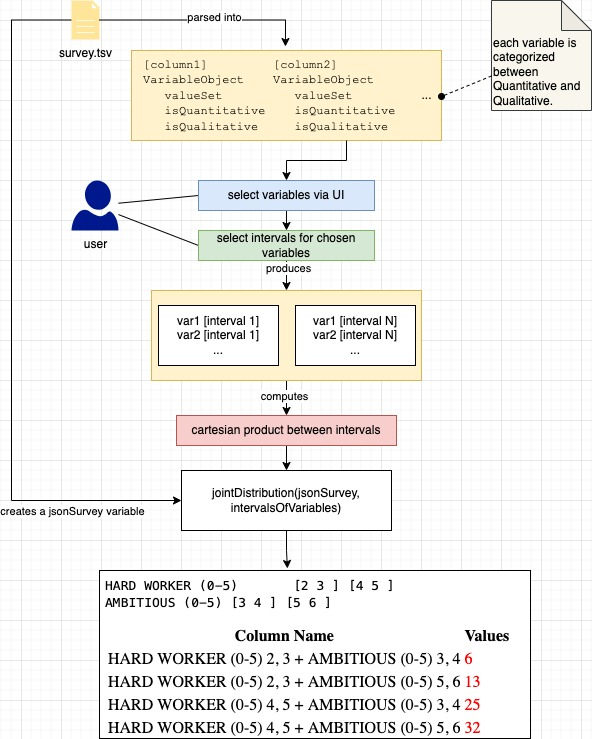
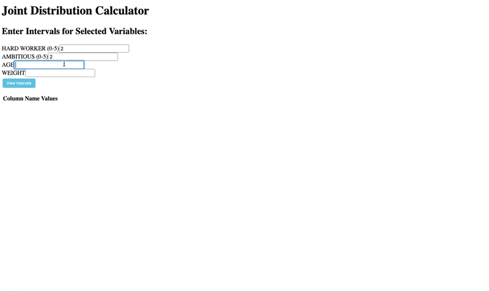

>#### Assignation
>
>Revise also your previous homework taking into account that qualitative variables can be ordered and therefore the order needs to be preserved.
>
>For quantitative variables, include the possibility to specify class intervals too.
>
>**Optional**
>Create a some visual representation of the distribution. Use creatively your fantasy and skills (you may invent new representations, if you like).
 

The main work in this exercise was to re-engineer entirely the way in which the questionnaire and variables are processed, in particular Classes were created to allow the categorization of variables between Quantitative and Qualitative, allowing values such as "maximum and minimum" to be obtained directly through the "get" methods of the class itself, greatly reducing the computational cost. Also used in the development of these classes were Sets(), special data structures that can be used like Arrays() but having the property of nonduplicity, so each element will be unique within the set

### Javascript
I created a small diagram to understand what the flow of the application is. It shows how the file is manipulated to create a list of variables, which are then filtered by the user, and for those selected, intervals are entered.

```javascript
class Variable {
  constructor(column) {
    this._column = cleanPossibleTypos(column).toUpperCase(); // Apply typo cleaning and make uppercase
    this._valueSet = new Set();
    this._isQuantitative = true;
    this._isQualitative = true;
  }

  add(value) {
    const cleanedValue = cleanPossibleTypos(value);
    if (isNaN(cleanedValue)) {
      this._isQuantitative = false;
      this._isQualitative = true;
    } else {
      this._isQualitative = false;
      this._isQuantitative = true;
    }
    this._valueSet.add(cleanedValue);
  }

  toString() {
    return this._column
  }

  get column() {
    return this._column;
  }

  get values() {
    return this._valueSet;
  }

  get min() {
    return this.values().max;
  }

  get max() {
    return this.values().min;
  }

  get isQualitative() {
    return this._isQuantitative;
  }
  get isQuantitative() {
    return this._isQuantitative;
  }
  get valueCounter() {
    return this._valueCounter;
  }
}
```
This class (Variable) is used by giving it as input all the values found (and divided by comma where necessary). For each input value, it is added to the set, and by also incrementing an occurrence counter, this comes in handy for calculating relative and absolute frequencies.

The snippet in charge of taking the values and cataloging them by means of the Variable class, is described below
```javascript
// creates the variable object, will be bidimensional array
for (let i = 1; i < headers.length; i++) {
    variables[cleanPossibleTypos(headers[i]).toUpperCase()] = new Variable(headers[i]);
}
// put in each variable[header] respective values
for (let i = 1; i < lines.length; i++) {
const values = lines[i].split('\t');
    for (let j = 1; j < values.length; j++) {
        const header = cleanPossibleTypos(headers[j]).toUpperCase();
        // if value contains string, maybe it's a qualitative then split value by comma
        if (values[j].includes(',')) {
            values[j].split(',').forEach(value => {
                variables[header].add(value.toUpperCase().trim());
            });
        } else
            variables[header].add(values[j].toUpperCase().trim());
    }
}
```
The creation of the joint-distribution is accomplished by the Cartesian product of the intervals, so that a "set" can be created that can be checked for each row of the surveyJson.
```javascript
...
var cartesianVariableJointed = cartesianProductWithColumn(Object.values(variables));
var jointDistribution = {}
for (const interval of cartesianVariableJointed) { // foreach probability combination
  const keyComboIndex = interval.map(obj => `${obj.columnName} ${Array.from(obj.interval).join(", ")}`).join(" + ");
  var counter = 0
  for (var index = 0; index < Object.keys(jsonSurvey)[0].length; index++) { // foreach row fo dictionary

    for (const item of interval) { // foreach interval inside combination
      jointDistribution[keyComboIndex] = 0
      const columnName = item.columnName;
      const intervalSet = item.interval;
      const valueToCheck = jsonSurvey[columnName][index];
      if (intervalSet.has(valueToCheck)) {
        counter++
      }
    }
  }
  jointDistribution[keyComboIndex] = counter
}
...
```
The variables first obtained from parsing the survey, are then filtered according to the intervals decided by the user, thus removing all pre-existing values not chosen by the user.
```javascript
const cleanVariables = (variables) => {
  const variableListSelect = document.getElementById('variableListSelect');
  const selectedValuesFromHTMLElement = getValueFromAMultipleSelect(variableListSelect);
  // Remove variables that are not selected in the multiple select element.
  Object.keys(variables).forEach((elm) => {
    if (!selectedValuesFromHTMLElement.includes(elm)) {
      delete variables[elm];
    }
  });
  // Remove the multiple select element from the document.
  document.getElementById('variables').removeChild(variableListSelect);
  return variables;
};
```


### CSharp
As with all other homeworks, the code in c# is a mere translation according to the syntax and peculiarities of the code.
```csharp
using System;
using System.Collections.Generic;

class Variable
{
    private string _column;
    private HashSet<string> _valueSet;
    private bool _isQuantitative;
    private bool _isQualitative;

    public Variable(string column)
    {
        _column = CleanPossibleTypos(column).ToUpper();
        _valueSet = new HashSet<string>();
        _isQuantitative = true;
        _isQualitative = true;
    }

    public void Add(string value)
    {
        string cleanedValue = CleanPossibleTypos(value);
        if (!double.TryParse(cleanedValue, out _))
        {
            _isQuantitative = false;
            _isQualitative = true;
        }
        else
        {
            _isQualitative = false;
            _isQuantitative = true;
        }
        _valueSet.Add(cleanedValue);
    }

    public override string ToString()
    {
        return _column;
    }

    public string Column
    {
        get { return _column; }
    }

    public HashSet<string> Values
    {
        get { return _valueSet; }
    }

    public double Min
    {
        get
        {
            if (_valueSet.Count == 0)
                throw new InvalidOperationException("No values in the set.");
            return _valueSet.Min(value => double.Parse(value));
        }
    }

    public double Max
    {
        get
        {
            if (_valueSet.Count == 0)
                throw new InvalidOperationException("No values in the set.");
            return _valueSet.Max(value => double.Parse(value));
        }
    }

    public bool IsQualitative
    {
        get { return _isQualitative; }
    }

    public bool IsQuantitative
    {
        get { return _isQuantitative; }
    }

 
}
```

```csharp
...
public Dictionary<string, Variable> CleanVariables(Dictionary<string, Variable> variables)
{
    // Assuming you have a ListBox control named "variableListSelect" on your form
    ListBox variableListSelect = myForm.Controls["variableListSelect"] as ListBox;

    List<string> selectedValuesFromListBox = GetValueFromListBox(variableListSelect);

    // Remove variables that are not selected in the ListBox.
    foreach (string key in new List<string>(variables.Keys))
    {
        if (!selectedValuesFromListBox.Contains(key))
        {
            variables.Remove(key);
        }
    }

    // Remove the ListBox control from the form.
    yourForm.Controls.Remove(variableListSelect);

    return variables;
}

public List<string> GetValueFromListBox(ListBox listBox)
{
    List<string> selectedValues = new List<string>();
    foreach (var item in listBox.SelectedItems)
    {
        selectedValues.Add(item.ToString());
    }
    return selectedValues;
}
...
```
```csharp
var cartesianVariableJointed = CartesianProductWithColumn(variables.Values.ToList());
var jointDistribution = new Dictionary<string, int>();

foreach (var interval in cartesianVariableJointed)
{
    string keyComboIndex = string.Join(" + ", interval.Select(obj =>
    {
        string column = obj.ColumnName;
        string intervalString = string.Join(", ", obj.Interval);
        return $"{column} {intervalString}";
    }));

    int counter = 0;
    for (int index = 0; index < jsonSurvey.Values.First().Count; index++)
    {
        foreach (var item in interval)
        {
            jointDistribution[keyComboIndex] = 0;
            string columnName = item.ColumnName;
            HashSet<string> intervalSet = item.Interval;
            string valueToCheck = jsonSurvey[columnName][index];
            if (intervalSet.Contains(valueToCheck))
            {
                counter++;
            }
        }
    }
    jointDistribution[keyComboIndex] = counter;
}
```