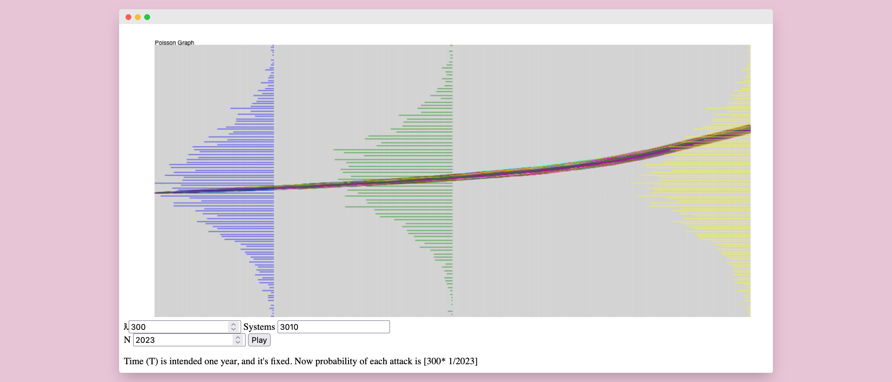

>#### Assignation
>**Research**
>Find out on the web about a Poisson point process. See if you can see any analogy with this Exercise and verify whether your distributions come close (for N, M sufficiently large) to the theoretical asymptotic distribution.
 


## What is Poisson Point Process (PPP)
**Poisson Point Process** is a statistical concept used to describe how random events occur in a specific space or over a certain period of time. In simple terms, it represents the distribution of events that happen randomly and independently within a defined area or time frame.

Here are some key characteristics of the Poisson Point Process:

1. **Random Events**: These are events that occur unexpectedly and without a regular pattern, such as arrivals in a gym, accidents on a road, unauthorized access attempts in a computer network, or any other occurrences that happen randomly.

2. **Independence**: In the Poisson Point Process, it is assumed that events are independent of each other, meaning the probability of one event happening is not influenced by previous or subsequent events.

3. **Mean Events (λ)**: The Poisson Point Process has a parameter called "λ" (lambda), representing the average number of events expected within a specific space or time period. This parameter defines the "event density."

4. **Poisson Distribution**: The Poisson distribution is used to calculate the probability of how many times a certain number of events will occur within a specific space or time interval based on the mean λ.

### An example
Imagine being a military analyst tasked with assessing the number of unwanted events, such as attacks or incidents, occurring in a specific area of a battlefield during a certain period. You want to better understand how often such events occur on average in that area.

1. **Random Events**: These are unpredictable events, representing unwanted incidents like enemy attacks, accidents, or any other undesirable occurrences that can take place on the battlefield.

2. **Independence**: It is assumed that these events are independent of each other, meaning that the occurrence of one event does not affect the probability of other similar events.

3. **Mean Events (λ)**: The parameter λ represents the average number of unwanted events expected in a given time period. For example, you might estimate that an average of 2 attacks occur per day in that area.

4. **Poisson Distribution**: The Poisson Point Process allows you to calculate the probability of a specific number of unwanted events occurring within that time period, using the Poisson distribution. For instance, you could calculate the probability of exactly 0 attacks happening in a day.

This approach could help you assess the risks in the area and plan necessary military resources or strategies based on the calculated probabilities. Please note that this example is purely theoretical and is not intended to promote military events or conflicts but rather serves as a statistical application for analysis.


In summary, the **Poisson Point Process** is a statistical tool that helps us model and understand **how random, independent events are distributed in time or space**. It is used in various fields, from queuing theory to security monitoring, to analyze and predict the frequency of rare and random events.

### In our homework
We have a Poisson Point Process that models the number of random events (attacks on a system) occurring in a specific time interval. 

In other words, by measuring the number of random events in progressively longer time intervals, the Law of Large Numbers confirms that the average of the observed data approaches the mean predicted by the Poisson model. This can be useful in verifying the validity of the Poisson model in the context of event of system attacked. 

## Coding
>#### Assignation
>
>M servers are subject to attacks during a period of time T (for instance 1 year).
Subdivide the interval T in N subinterval of size T/N and in each of this suppose that an attack can occur with probability λ T/N.
>Simulate the attacks to the M servers and represent each of them with a line which makes jumps of 1 at each attack event.
>
>Using the same objects ("movable/resizable rectangle", histogram, etc.) of the previous homework 3 draw vertically on the line chart the 2 histograms representing the distribution of the number of attacks at the end of the period and one internal istant for comparison.
>
>Study what happens asymptotically, for N large, and a number of systems M a sufficient to give shape to
a simulated distribution. Make some personal considerations about the shape and the average of the distributions that you see.
>
So as per requests, the work done for this homework was mainly based on all the code already done for homework 2.
In this case only the "POI" casework was added, which represents the calculation using the formula $\Lambda * \frac{T}{N}, T=1$

Thus, the part of the code that was changed was not the graphics and rendering part but the calculation of the attack matrix.

Only the modified code snippets for this exercise are given below

### Javascript
```js
> attackMonitor.js
    buildMatrix() {
        const matrix = [];
        for (let i = 0; i < this.nSys; i++) {
            const row = [];
            row.push({color:"#" + ((1 << 24) * Math.random() | 0).toString(16),final:0,middle:0})
            for (let j = 0; j < this.nAtk; j++) {
                // Populates the matrix with true or false based on the attack probability
                if(this.mode!="POI")row.push(Math.random() <= this.probability ? true : false);
                else if(this.mode==="POI") row.push(Math.random() <= (this.probability*(1/j)) ? true : false);
            }
            matrix.push(row);
        }
        return matrix;
    }
}
```
```js
> index.html
const graphSettings = { probability: lambdaInput, nSystems: sysInput, nAttacks: denominatorN, mode:"POI" };

const graphUISettings = {fill: "rgba(200, 200, 200, 0.5)", border: "black", borderWidth: 2 }

const attackManager = new AttackMonitor(graphSettings)
const attackMatrix = attackManager.getMatrix()

var graph1 = new AnimatedGraph(app.canvas, { ...initialRectSize, x: 50, y: 20 }, { ...graphUISettings, label: "Poisson Graph" }, graphSettings)
graph1.setAttackMatrix(attackMatrix)
app.addObjects([graph1]);
```

**Notice** For this exercise, in addition to the change on the calculation of the probability of the attack, I also preferred to make a change on the number of graphs, thus creating a new graph (in blue) in the first fifth of the X-axis. The new graph helps to better understand what is the trend of the system

### CSharp
Same as for Javascript, also for C Sharp the code changed is only referred to `SimulateAttack()` function
```csharp
/**
 * Simulates attacks on a collection of ResizeableRectangle objects.
 *
 * @param p Probability of successful attack.
 * @param nattacks Number of attacks to simulate.
 * @param color Color used for simulating attacks.
 */
public void SimulateAttacks(double p, int nattacks, Color color)
{
    // Check if there are no ResizeableRectangles to simulate attacks on
    if (rrs.Count == 0) return;
    double generated;
    bool defended;
    double lambda;

    for (int i = 0; i < nattacks; i++)
    {
        generated = r.NextDouble();
        defended = p > generated;

        // Iterate through each ResizeableRectangle in the collection
        foreach (ResizeableRectangle rr in rrs)
        {
            if(rr.ct == chartType.FreqSubintervals)
            {
                lambda = p;
                defended = (lambda / rr._N) < generated; // Normalize by T
            }

            // Simulate the attack on the current ResizeableRectangle
            rr.SimulateAttack(defended, color, _SYSTEMS_COUNT);
        }

        // Record whether the attack was defended or not
        this.attacks.Add(defended);
    }
}
```

[Try it ✦](../assets/labs/hw5/index.html)
