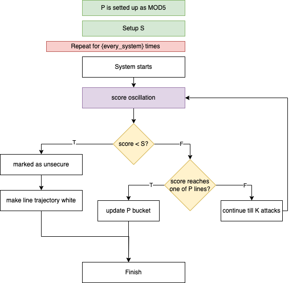
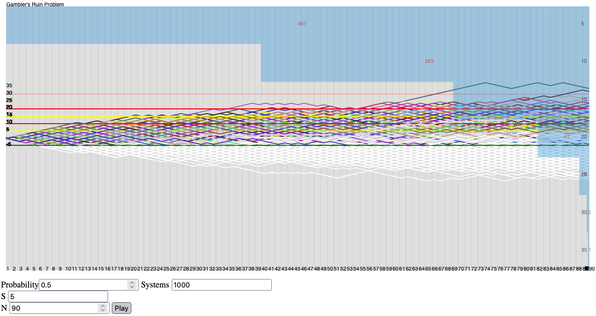

>#### Assignation
>**Research**
>Find out on the web about the "Gambler's Ruin Problem". See if you can see any analogy with this exercise and make your personal consideration about what your simulation is suggesting to you. 
 

## Gambler's ruin problem
The Gambler's Ruin problem is a mathematical concept dealing with the probabilities and financial dynamics associated with gambling. This problem is often formulated in terms of bets between two players, known as "player A" and "player B," who are playing a series of games with different odds of winning.

The typical situation involves two players who each initially have a certain amount of money. Each round or game, one of the players wins a certain amount of money from the other. The main problem is to determine the probability that one player will go broke, that is, lose all his money.

Suppose there are two players, $A$ and $B$, with $A$ initially having aa units of money and $B$ having bb units of money. At each turn, $A$ wins from $B$ a certain amount of money with probability $pp$, and $B$ wins from A with probability $q=1-p$. The players continue playing until one of them goes broke, that is, loses all his money.

The player ruin problem is interesting because it deals with the probability of a player's bankruptcy in the long run, given a certain set of probabilities of winning. The solution often involves the use of Markov chains and can lead to surprising results.

### Markov chains
Markov chains are probabilistic models that describe a sequence of events in which the probability of transition from one state to another depends only on the current state and not on the sequence of previous events. This property is known as the Markov property.

In a Markov chain, the system can be in any one of a discrete set of states, and transitions between states are governed by transition probabilities. The transition probability from one state to another is called the "first-order transition probability" **and depends only on the current state**, not on how the system got to that state.

The Markov property implies that the probability of being in a future state depends only on the current state and not on the sequence of previous states. This makes Markov chains particularly useful for modeling systems that evolve over time in a "random" or "irregular" manner.

Ref. 
- [Gambler's Ruin Problem](https://towardsdatascience.com/the-gamblers-ruin-problem-9c97a7747171)
- [Random Walks](https://web.mit.edu/neboat/Public/6.042/randomwalks.pdf)
- [Markov Chains](http://www.stat.yale.edu/~pollard/Courses/251.spring2013/Handouts/Chang-MarkovChains.pdf)

## Let's code
Same as the previous exercise, the logic of the calculations is explained below, highlighting only the snippets that differ from the previous homework assignments. In the following explanation, we delve into the specific computation details, focusing on the aspects that distinguish this exercise from the previous ones.

Let's briefly explain how the code works (with a block diagram) for this simulation.


```js
 if (this.mode === "GRP") {
    let dead = false
    if (score <= -Math.abs(this.deadTreshold)) {
        if (!dead) {
            dead = true
            attackVector[0]['color'] = "white"
            if (score == -Math.abs(this.deadTreshold))
                this.drawLineOfScore(baseYaxis, numberOfAttacks, score, attackVector[0]['color'], "green")
        }
    }
    if (score > 0 && score % 5 == 0 && localScore[score] == undefined && attackVector[0]['color'] !== "white") {
        if (this.brokeProcess[`${score}`] == undefined) this.brokeProcess[`${score}`] = 0
        localScore[score] = 0
        if (score % 10 == 0) {
            //update P bucket
            this.brokeProcess[`${score}`] += 1
            //create line of P
            this.drawLineOfScore(baseYaxis, numberOfAttacks, score, attackVector[0]['color'], "red")
        } else {
            //update P bucket
            this.brokeProcess[`${score}`] += 1
            this.drawLineOfScore(baseYaxis, numberOfAttacks, score, attackVector[0]['color'], "yellow")
        }
    }
}
```


[Try it ✦](../assets/labs/hw6/index.html)