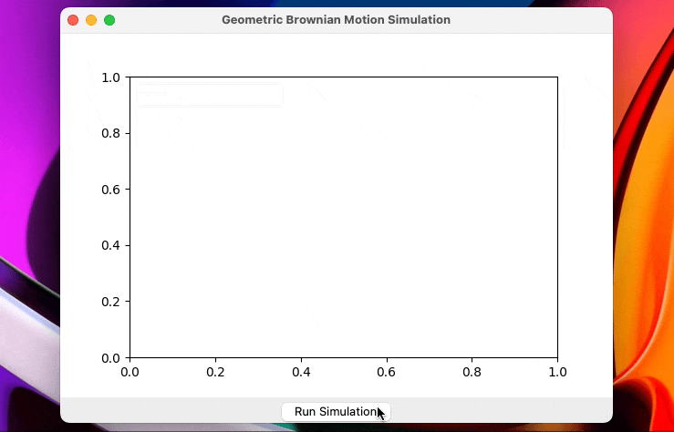

## The Wiener Process:

The Wiener process, also known as Brownian motion, is a continuous stochastic process (*) that models the random motion of particles in a fluid. It is characterized by independent and stationary increments, meaning that the increments in equally spaced time intervals are statistically independent, and the distribution of increments does not change over time.

### Mathematical Representation:

The Wiener process $W_t$ is often represented as:

$W_t = W_0 + \mu t + \sigma B_t$

where:
- $W_0$ is the initial value of the process.
- $\mu$ is the drift, representing the average growth rate.
- $\sigma$ is the volatility, representing the dispersion of random increments.
- $B_t$ is a standard Brownian motion.

## The Geometric Brownian Motion (GBM):

The GBM is a generalization of the Wiener process and is commonly used to model the evolution of financial asset prices. It incorporates a constant drift and volatility into the equation, making it suitable for describing the exponential growth or decay of a quantity over time.

### Mathematical Representation:

The GBM is represented as:

$S_t = S_0 \exp\left(\left(\mu - \frac{\sigma^2}{2}\right)t + \sigma W_t\right)$

where:
- $S_t$ is the asset price at time $t$.
- $S_0$ is the initial price of the asset.
- $\mu$ is the average growth rate.
- $\sigma$ is the volatility.
- $W_t$ is a Wiener process.

## Derivations:

### Wiener Process:
The Wiener process is derived from the properties of normally distributed random variables and their sums. It involves constructing random walks with infinitesimally small steps and taking the limit as the step size approaches zero.

### Geometric Brownian Motion:
The GBM can be derived using stochastic calculus, specifically Itô's lemma. This involves expressing the asset price as a function of the Wiener process and then applying the lemma to find the stochastic differential equation governing the process.

## In Brief:

Imagine you're tracking the movement of a particle in water (Wiener process). The particle moves randomly, and the Geometric Brownian Motion is like describing the value of a stock that goes up and down over time. It's like predicting where the particle or stock will be in the future, considering its average movement and randomness.

(*) stochastic process : *A stochastic process is a mathematical model that describes the evolution of a system over time where randomness plays a crucial role, representing the uncertainty or variability in its outcomes. It involves the concept of a random variable evolving through different time points.*

**References**
1. [Wiener, N. (1923). Differential-space. Journal of Mathematical Physics](https://sci-hub.se/10.1002/sapm192321131)
2. [La nascita della finanza moderna: l’incontro dell’economia con la fisica](https://startingfinance.com/approfondimenti/nascita-finanza-moderna-fisica/)
3. [Calcolo stocastico per la finanza](https://books.google.it/books?id=aWQO51T0LA8C&pg=PA1&hl=it#v=onepage&q&f=false)

### A Simulation
In Python, the script represent a Wiener process simulation involves generating random increments to model continuous random motion. For simulating Geometric Brownian Motion (GBM), stochastic calculus principles are applied to simulate exponential growth or decay of a quantity, commonly used for financial asset prices. 

```
GBMSimulationApp
|___ Initialize with Tkinter root
|___ Create canvas for Matplotlib plot
|___ Add button for simulation
|___ Initialize subplot during initialization
|___ Define geometric_brownian_motion function
     |___ Simulate Wiener process
     |___ Simulate GBM using stochastic calculus
          |___ Define parameters:
                - num_steps: Number of time steps
                - mu: Average growth rate
                - sigma: Volatility
                - dt: Time step
                - S0: Initial price
          |___ Initialize arrays:
                - t: Time array
                - S: Price array
          |___ Implement simulation loop:
                |___ Generate random Wiener increments
                |___ Calculate GBM increments
                |___ Accumulate GBM increments
          |___ Return time (t) and simulated prices (S)
|___ Define plot_gbm_simulation method
     |___ Clear previous plot
     |___ Call geometric_brownian_motion to simulate GBM
     |___ Plot new GBM simulation
     |___ Update the canvas

```

```py

def geometric_brownian_motion(num_steps, mu, sigma, dt, S0):
    """
    Simulate a geometric Brownian motion.

    Parameters:
    - num_steps (int): Number of time steps.
    - mu (float): Mean growth rate.
    - sigma (float): Volatility.
    - dt (float): Time step.
    - S0 (float): Initial price.

    Returns:
    - t (numpy.ndarray): Array of time steps.
    - S (numpy.ndarray): Array of simulated prices.
    """
    t = [i * dt for i in range(num_steps + 1)]
    S = [0] * (num_steps + 1)
    S[0] = S0

    for i in range(1, num_steps + 1):
        dW = random.normalvariate(0, math.sqrt(dt))
        dS = mu * S[i-1] * dt + sigma * S[i-1] * dW
        S[i] = S[i-1] + dS

    return t, S
```
```py
    def plot_gbm_simulation(self):
        """
        Run the GBM simulation and plot the results on the canvas.
        """
        t, S = geometric_brownian_motion(self.num_steps, self.mu, self.sigma, self.dt, self.S0)

        # Clear the previous plot
        self.subplot.clear()
        self.subplot = self.figure.gca()
        # Plot the new simulation
        self.subplot.plot(t, S, label='GBM Simulation')
        self.subplot.set_title('Geometric Brownian Motion Simulation')
        self.subplot.set_xlabel('Time')
        self.subplot.set_ylabel('GBM Value')
        self.subplot.legend()

        # Update the canvas
        self.canvas.draw()
```

