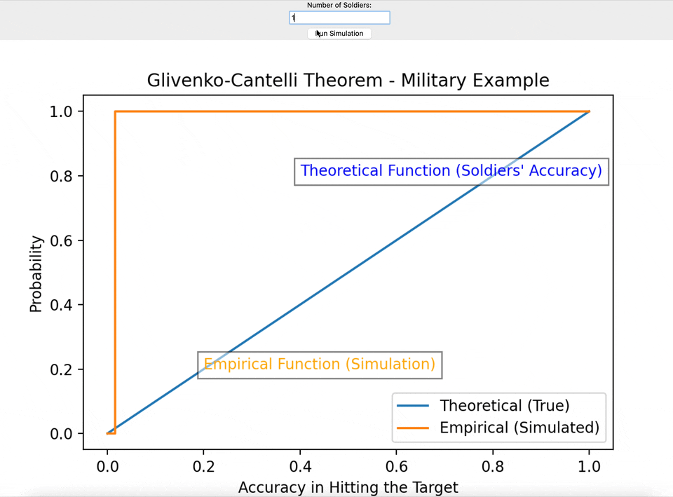

The Glivenko-Cantelli theorem is a fundamental result in probability theory and statistics. It states that, given a sample of independently and identically distributed (i.i.d.) random variables from a certain probability distribution, the empirical distribution function converges uniformly to the theoretical distribution function.

In simpler terms, if you have a large sample from a population and calculate the empirical distribution function (cumulative) of the sample, it will increasingly approximate the true distribution function of the population as the sample size grows.

## Demonstration (Simplified)

The demonstration of the Glivenko-Cantelli theorem involves constructing the empirical distribution function (EDF) and estimating its uniform convergence to the theoretical distribution function.

1. **Definition of Empirical Distribution Function (EDF)** The EDF is a step function that assigns to each point the ratio of observations below that point in the sample. The EDF gets closer and closer to the theoretical distribution function as the observations in the sample increase.

2. **Uniform Convergence** The key to the demonstration is to show that the difference between the EDF and the theoretical distribution function approaches zero uniformly, i.e., for every point on the scale. This process involves concepts from probability theory and measurable functions.

3. **Law of Large Numbers (LLN)** The LLN states that, as the sample size increases, the sample mean converges to the theoretical mean. This result is often used as an intermediate step in the demonstration of the Glivenko-Cantelli theorem.

**In Brief**

Imagine you have a lot of soldiers, and each soldier represents how good they are at hitting a target. The Glivenko-Cantelli theorem is like saying that if you have many toy soldiers and you look at how good they are, the average skill you see will get really close to how good all the soldiers are overall. It's like having a big group of soldiers, and the more you look at them, the better you understand how skilled they are at hitting targets.

## Simulation in python
