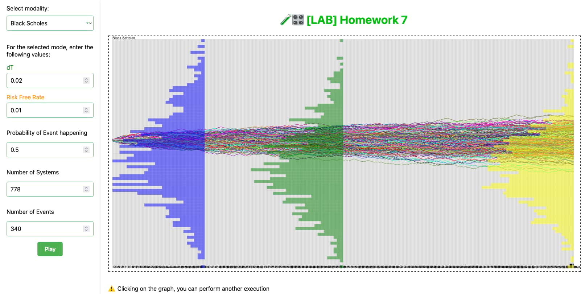

>#### Assignation
>**Research**
>First of all realize that the general scheme that you used so far (random walk and also Poisson process, etc.), can, more in general, be used for any stochastic differential equations SDE (see, for instance, Euler–Maruyama method https://en.wikipedia.org/wiki/Euler%E2%80%93Maruyama_method).
>
>In other words, with minor additions to your program you can now generalize this tool to simulate almost any stochastic differential equations of interest for many applications
>
>Create a web only version where you allow the user to explore (selectable by user) any useful stochastic process. 


## Theory
1. **Arithmetic Brownian Motion**:
   - **Description**: A simple model where the asset's price changes over time with a constant drift and a random, normally distributed shock.
   - **Formula (increment)**: $\Delta S = \mu \Delta t + \sigma \epsilon \sqrt{\Delta t}$
   - **Example**: Used in pricing options and modeling stock prices.

2. **Geometric Brownian Motion**:
   - **Description**: Extends Arithmetic Brownian Motion by considering the continuously compounded returns, crucial in the Black–Scholes option pricing model.
   - **Formula (increment)**: $\Delta S = S(\mu \Delta t + \sigma \epsilon \sqrt{\Delta t})$
   - **Example**: Widely applied in financial markets for option pricing, guiding investment decisions.

<figure><figcaption align = "center"><b>Fig.1 - Demonstration of Geometric Standard adn Aritmetic Brownian Motion</b></figcaption></figure>

3. **Ornstein–Uhlenbeck (Mean-Reverting)**:
   - **Description**: Models a mean-reverting process, suitable for interest rates or other factors returning to a long-term average.
   - **Formula (increment)**: $\Delta X = \theta(\mu - X) \Delta t + \sigma \epsilon \sqrt{\Delta t}$
   - **Example**: Used in interest rate modeling, predicting future rates.


4. **Vasicek Model**:
   - **Description**: Models interest rates as mean-reverting processes, incorporating a term structure.
   - **Formula (increment)**: $\Delta r = \alpha(\beta - r) \Delta t + \sigma \epsilon \sqrt{\Delta t}$
   - **Example**: Applied in fixed income securities pricing and interest rate derivatives.

5. **Hull–White Model**:
   - **Description**: Models short-term and long-term interest rates, addressing the limitations of other models.
   - **Formula (increment)**: $\Delta r = (\theta(t) - a(t)r) \Delta t + \sigma(t) \epsilon \sqrt{\Delta t}$
   - **Example**: Applied in interest rate derivatives pricing, especially for complex structures.


These models play crucial roles in financial engineering, risk management, and investment strategies. While simpler models like Arithmetic Brownian Motion find applications in basic scenarios, more complex models like Heston are essential for capturing intricate market behaviors. 

References 
- [Using Hull-White interest rate tree](https://www-2.rotman.utoronto.ca/~hull/downloadablepublications/USETREE.pdf)
- [A Brief Look at OU, Vasicek, CIR and Hull-
White Models Through Their Actuarial
Applications](https://dergipark.org.tr/en/download/article-file/1953547)
- [🇮🇹 Come prevedere il tasso di disoccupazione](https://finanzaeinvestimenti.it/didattica/analisi-fondamentale/come-prevedere-il-tasso-di-disoccupazione/)
- [🇮🇹 Moto Browniano e applicazioni ai mercati finanziari](https://www.fisica.unina.it/documents/12375590/13725484/3204_ConteD.pdf/b05449ba-e405-4f94-a4dc-8bef33db805a)
- [Brownian Motion](https://stats.libretexts.org/Bookshelves/Probability_Theory/Probability_Mathematical_Statistics_and_Stochastic_Processes_(Siegrist)/18%3A_Brownian_Motion)

## Coding
Only one of the formulas used for calculating the increment of stochastic differential equations is shown below. The others which required less code have been included in the "scoreCalculation" module.


- `calcSDE_BlackScholes(previousPrice, volatility, riskFreeRate, dt, attack)` is for calculating that particular stochastic equation, having several steps, I preferred to create a separate function.
```js
calcSDE_BlackScholes(previousPrice, volatility, riskFreeRate, dt, attack) {
    // Black-Scholes parameters
    const sigma = volatility;
    const r = riskFreeRate;

    // Generate a random increment
    const dW = Math.sqrt(dt) * Math.random();

    // Runge-Kutta coefficients
    const k1 = dt * (r * previousPrice - 0.5 * sigma * sigma * previousPrice) + sigma * dW;
    const k2 = dt * (r * (previousPrice + 0.5 * k1) - 0.5 * sigma * sigma * (previousPrice + 0.5 * k1)) + sigma * Math.sqrt(dt) * Math.random();
    const k3 = dt * (r * (previousPrice + 0.5 * k2) - 0.5 * sigma * sigma * (previousPrice + 0.5 * k2)) + sigma * Math.sqrt(dt) * Math.random();
    const k4 = dt * (r * (previousPrice + k3) - 0.5 * sigma * sigma * (previousPrice + k3)) + sigma * Math.sqrt(dt) * Math.random();

    // Update the price based on the Runge-Kutta formula
    const increment = (k1 + 2 * k2 + 2 * k3 + k4) / 6;

    // Apply the increment based on the attack flag
    return attack ? previousPrice + increment : previousPrice - increment;
}
```

### Improvements
The following are the main improvements in homework 7.
- `gaussianRand` is for obtaining a random number from a Gaussian distribution.
- `scoreCalculation(mode, previousScore, attack, attackCounter, attackVector)` is the new "core" of the application, capable of calculating trajectory increment or decrement, based on a key it receives as input from the user, each key representing a different way of calculation.

```js
gaussianRand() {
        return Math.sqrt(-2 * Math.log(Math.random())) * Math.cos((2 * Math.PI) * Math.random())
    }

scoreCalculation(mode, previousScore, attack, attackCounter, attackVector) {
    switch (mode) {

        case "SCR": //SCORE
            if (!attack) return previousScore - 1
            else return previousScore + 1
        case "GRP": //SCORE
            if (!attack) return previousScore - 1
            else return previousScore + 1
        case "ABS": //SCORE
            if (!attack) return previousScore
            else return previousScore + 1
        case "REL": //RELATIVE FREQUEnCY
            if (attack) return previousScore + (this.realAttackCounter(attackVector, attackCounter)) / attackCounter;
            else return previousScore
        case "NOR": //NORMALIZED
            if (attack) return previousScore + this.realAttackCounter(attackVector, attackCounter) / Math.sqrt(attackCounter)
            else return previousScore
        case "SDEgenBRNMTN"://general brawnian motion
            var sigma = Math.sqrt(this.nAtk * this.probability * (1 - this.probability));
            var mu = this.nAtk * this.probability;
            if (attack) return previousScore + (1 / Math.sqrt(this.nAtk)) * (mu + sigma * this.gaussianRand());
            else return previousScore - (1 / Math.sqrt(this.nAtk)) * (mu + sigma * this.gaussianRand());
        case "SDEBRNMTN"://standard brawnian motion
            if (attack) return previousScore + Math.floor(attackCounter + this.gaussianRand() * (attackVector.length - attackCounter + 1));
            else return previousScore - Math.floor(attackCounter + this.gaussianRand() * (attackVector.length - attackCounter + 1));
        case "SDEgeoBRNMTN": //geometric brawnian motion
            var mu = this.extraParams['mu']; // passo temporale
            var sigma = this.extraParams['sigma']
            var inc = mu + sigma * this.gaussianRand()
            if (attack) return previousScore + Math.exp(inc);
            else return previousScore - Math.exp(inc);

        case "SDEhullWHITE": // Hull-White tramite il metodo di Runge-Kutta
            var sigma = Math.sqrt(this.nAtk * this.probability * (1 - this.probability));
            var dt = this.extraParams['dt']; // passo temporale
            var theta = this.extraParams['theta']
            let r = previousScore; // tasso di interesse iniziale
            var dW = Math.sqrt(dt) * Math.random(); // incremento di Wiener
            var k1 = dt * (theta - 0.1 * r) + sigma * dW;
            var k2 = dt * (theta - 0.1 * (r + 0.5 * k1)) + sigma * Math.sqrt(dt) * Math.random();
            var k3 = dt * (theta - 0.1 * (r + 0.5 * k2)) + sigma * Math.sqrt(dt) * Math.random();
            var k4 = dt * (theta - 0.1 * (r + k3)) + sigma * Math.sqrt(dt) * Math.random();
            if (attack) return previousScore + (k1 + 2 * k2 + 2 * k3 + k4) / 6;
            else return previousScore - (k1 + 2 * k2 + 2 * k3 + k4) / 6;
        case "SDEblackSCHOLES":
            // Esempio di utilizzo
            var riskFreeRate = this.extraParams['riskFreeRate'];
            var dt = this.extraParams['dt']; // passo temporale
            return this.calcSDE_BlackScholes(previousScore, this.probability, riskFreeRate, dt, attack);

        case "POI": //POISSON INCRMNT
            if (attack) return previousScore + 1
        default:
            return previousScore
    }
}
```
#### How trajectories are represented
Another improvement has also been made on the trajectory drawing method, which has gone from very complex, hardcoded code to something that can be clearly read in a few lines
```js
 /**
 * Analyzes a system based on an attack vector and draws the corresponding graph lines.
 *
 * @param attackVector An array representing the attack vector for the system.
 */
analyzeSystem(attackVector) {
    var x = 0;
    var score = 1;
    this.context.strokeStyle = attackVector[0]['color']
    var numberOfAttacks = attackVector.length - 1
    var baseYaxis = this.rect.y + this.rect.height / 2
    let baseXaxis = this.rect.x
    let atkC = 0
    let localScore = {}
    let maxValue = this.maxValuePossible(this.mode, attackVector)
    let dead = false
    let drawLineOfScore = (score, color) => this.drawLineOfScore(baseYaxis, numberOfAttacks, score, attackVector[0]['color'], color);
    for (let i = attackVector.length; i > 0; i--) {
        atkC++
        this.context.beginPath();
        this.context.moveTo(baseXaxis + x, baseYaxis - (score) * (this.rect.height / 2) / maxValue)
        score = this.scoreCalculation(this.mode, score, attackVector[i], atkC, attackVector)
        x = (attackVector.length - i) * (this.rect.width / (numberOfAttacks));
        this.context.lineTo(baseXaxis + x, baseYaxis - (score) * (this.rect.height / 2) / maxValue)
        this.context.stroke();
        if (Math.floor(numberOfAttacks / 2) == atkC) { attackVector[0]['middle'] = (score) }
        if (Math.floor(numberOfAttacks / 5) == atkC) { attackVector[0]['start'] = (score) }
        this.handleGRPMode(score, drawLineOfScore, attackVector, dead, localScore);
        attackVector[0]['final'] = (score)
    }
}
```
#### User interface
Last but not least was the change to the graphical interface, which now appears neater and cleaner, giving the user the freedom to select the chart method they prefer, and to be able to enter extra fields if required

[Try it ✦](../assets/labs/hw7/index.html)

## Extras
> **Assignation**
>
> Compare also with other possible simulation schemes which have been proposed
> eg, Milstein, Runge-Kutta, Heun's, ...), pointing out possible differences. 

Numerical methods play a crucial role in solving complex mathematical problems, with Milstein and Runge-Kutta being two notable techniques. Milstein specializes in tackling stochastic differential equations (SDEs) characterized by high nonlinearity, making it well-suited for systems with intricate dynamics. On the other hand, Runge-Kutta stands out for its versatility and simplicity in handling ordinary differential equations (ODEs), offering increased accuracy through higher-order variations.

For example, RangeKutta is used in computer graphics and animation to simulate the motion and behavior of objects in a virtual environment. It helps in **creating realistic and dynamic simulations**, also in astrophysics to model the motion of celestial bodies, gravitational interactions, and other dynamic phenomena in the universe.

In the realm of stochastic processes, these models capture the inherent randomness observed in various phenomena. Arithmetic Brownian Motion, for instance, **describes continuous-time random processes** and finds application in illustrating price fluctuations within financial instruments. Geometric Brownian Motion, notably employed in the Black–Scholes model, characterizes the logarithmic behavior of stock prices by incorporating elements of drift and volatility.

In summary, **numerical methods like Milstein and Runge-Kutta provide tools for solving mathematical equations**, while **stochastic processes** such as Arithmetic and Geometric Brownian Motions, Ornstein–Uhlenbeck, Vasicek, and Hull–White **focus on capturing the random characteristics of real-world phenomena**, particularly in financial contexts. The choice between these approaches depends on the specific nature and goals of the mathematical or financial modeling task at hand.

### Explain in very simple terms 🌈
Imagine you're trying to plan a road trip from your home to a new city. You have a map, and you want to **find the best route** to get there. That's a bit like using numerical methods in math. You break down the journey into **smaller steps**, like figuring out each turn and road, until you reach your destination.

Now, think about the weather during your road trip. It might be sunny for a while, then suddenly there's a rain shower, and later it clears up. The weather can be a bit **unpredictable**. This is where stochastic processes come in. They help us understand and **model things that change randomly**, like how the weather changes during your trip.

So, in math, **numerical methods are like planning your road trip step by step**, while **stochastic processes help us understand things that have an element of randomness**, such as the changing weather along the way.  

References
- [Range Kutta](https://www.collimator.ai/reference-guides/what-is-the-runge-kutta-method)
- [Layman's explanation on stochastic and statistical models](https://stats.stackexchange.com/questions/364510/laymans-explanation-on-stochastic-and-statistical-models)
- [Stochastic Processes and Numerical Methods](https://www.umu.se/en/research/groups/stochastic-processes-and-numerical-methods/)
