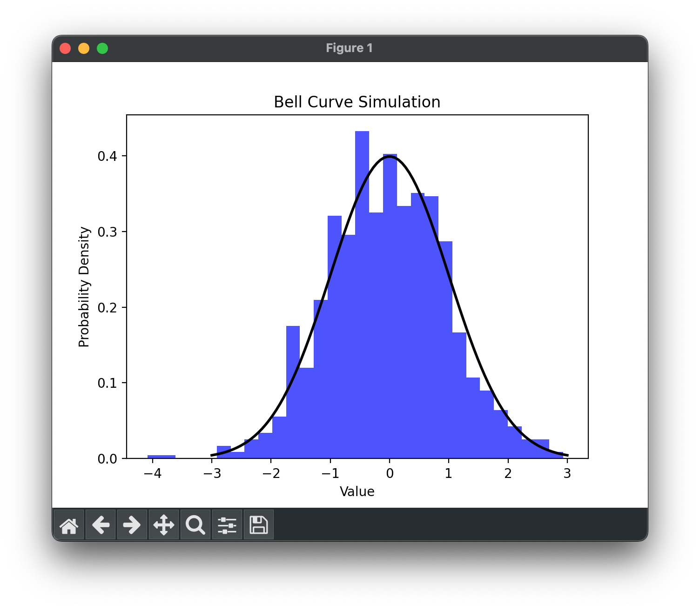

### Theory
**Meaning:**
The Gaussian distribution, or normal distribution, is like a friendly bell-shaped curve that shows up in many things around us. It's symmetrical, and most values cluster around the middle.

**Probability Density Function (PDF):**
The fancy formula for this bell curve is a bit complex, but it helps us figure out how likely different values are. Don't worry too much about the formula; just know it describes the shape of the curve.

The PDF of the Gaussian distribution is given by the formula:

$$f(x | \mu, \sigma) = \frac{1}{\sigma \sqrt{2\pi}} e^{-\frac{1}{2}\left(\frac{x - \mu}{\sigma}\right)^2}$$
where:

- $(x | \mu, \sigma)$ is the probability density function (PDF) of the Gaussian distribution.
- $x$ represents a specific value.
- $μ$ is the mean (average) of the distribution.
- $σ$ is the standard deviation, which measures how spread out the values are.
- $e$ is the mathematical constant.

**Derivations:**
Two key points about this bell curve: it's symmetrical around its middle, and there's a handy rule. Roughly 68% of the values are close to the middle, 95% are within a bit wider range, and 99.7% cover an even broader span.


### Coding simulation
```py
import numpy as np
import matplotlib.pyplot as plt

# Parameters
mean = 0
std_dev = 1
num_samples = 1000

# Generate random samples
samples = np.random.normal(mean, std_dev, num_samples)

# Plot histogram and theoretical curve
plt.hist(samples, bins=30, density=True, alpha=0.7, color='blue')
plt.plot(np.linspace(-3, 3, 100), 1/(std_dev * np.sqrt(2 * np.pi)) * np.exp(-((np.linspace(-3, 3, 100) - mean)**2) / (2 * std_dev**2)), 'k', linewidth=2)

# Add labels and title
plt.title('Bell Curve Simulation')
plt.xlabel('Value')
plt.ylabel('Probability Density')

plt.show()
```
